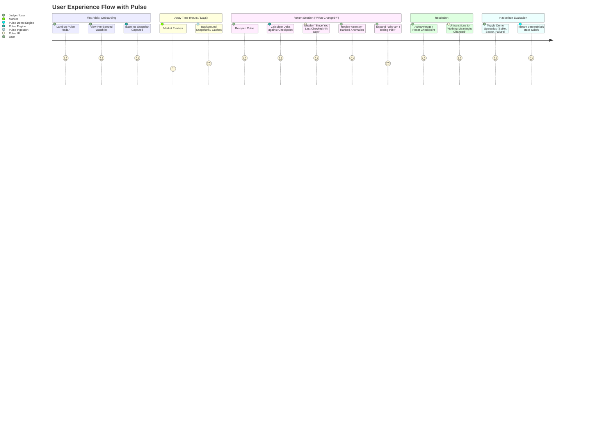
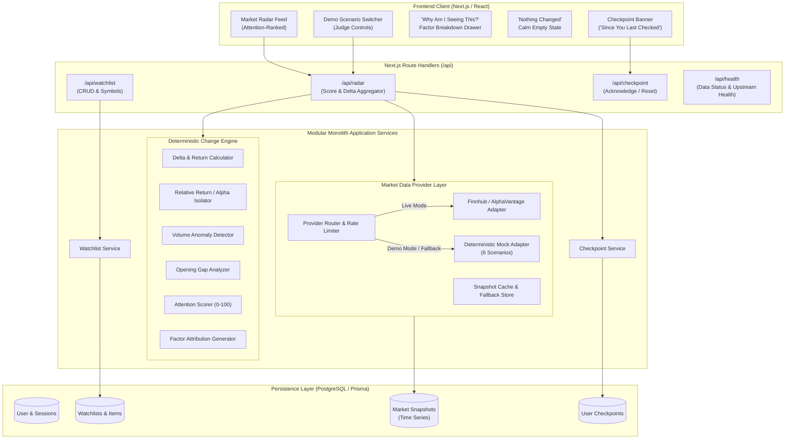
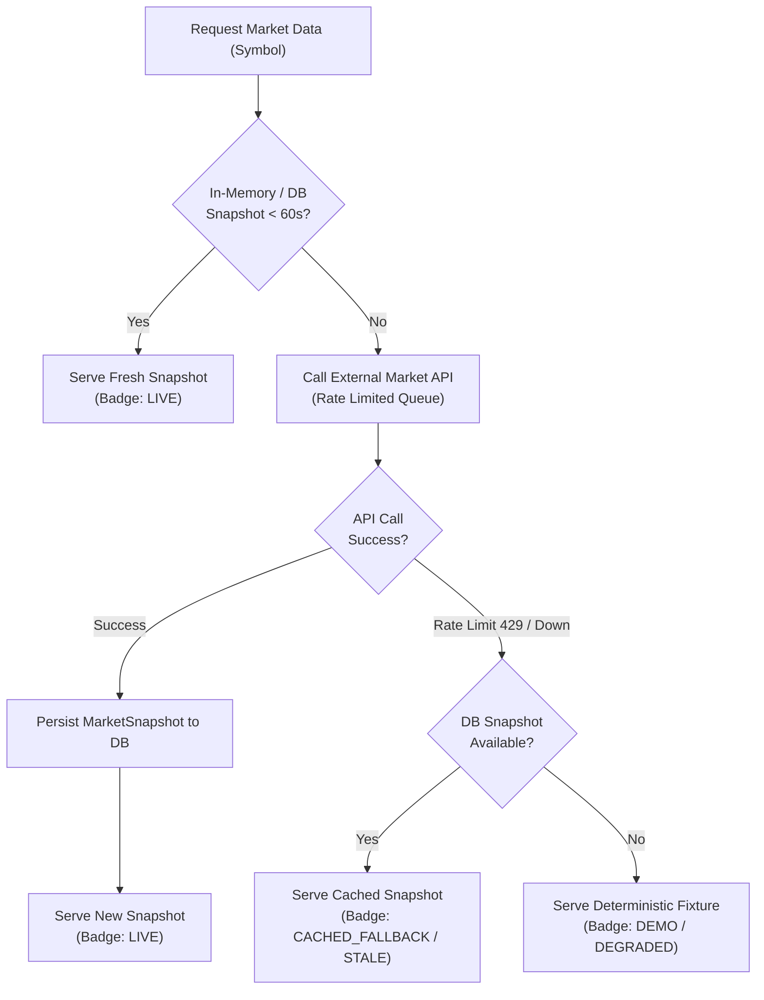

# PULSE — Your Market Change Radar
## System Architecture & Product Specification (Single Source of Truth)

**Project Name:** PULSE — Your Market Change Radar  
**Context:** Hackathon Engineering Build  
**Target Stack:** Next.js (App Router), TypeScript, Tailwind CSS, PostgreSQL, Prisma, Zod, Recharts  
**Document Version:** 1.0.0  
**Status:** Canonical Baseline Specification  

---

## 1. Product Definition

### 1.1 Vision & Core Value Proposition
Conventional financial watchlists (Yahoo Finance, TradingView, Robinhood, Apple Stocks) are designed as continuous telemetry feeds: endless streams of blinking green and red prices, raw percentage fluctuations, and noisy alert bells. For the everyday investor, part-time trader, or portfolio watcher, this creates cognitive overload, continuous checking anxiety, and decision fatigue.

**Pulse** shifts the paradigm from continuous monitoring to **calm, asynchronous delta detection**.

> **The Core Question Pulse Answers:**  
> *"What meaningfully changed since I last checked, and what deserves my attention now?"*

Pulse calculates the delta between a user's personal baseline (the moment they last checked or an acknowledged checkpoint) and the current market state. It decouples individual stock movement from broader market/sector drift, assesses abnormal volume and gap behavior, and produces an **explainable, attention-ranked radar feed**.

### 1.2 Core Product Principles
1. **Respect Human Attention:** If the market is behaving nominally or moving purely on market-wide drift, Pulse proudly presents: **"Nothing meaningful changed."** A calm zero-state is a first-class feature, not an empty state error.
2. **Deterministic & Explainable:** Pulse never relies on a black-box LLM to determine whether an asset movement is "meaningful." All scoring, severity tiers, and anomaly categorizations are computed by a deterministic, mathematically transparent engine with clear factor attribution.
3. **Context Over Raw Percentage:** A $+3\%$ move in a semiconductor stock when the semiconductor ETF is up $+3.2\%$ is market beta, not company-specific news. Conversely, a $+2\%$ move in an otherwise quiet flat market with $3\times$ average volume is an attention-worthy anomaly.
4. **No Price Predictions or Financial Advice:** Pulse does not provide buy/sell recommendations, price targets, or algorithmic trading signals. It is an observational intelligence radar, not an advisor.
5. **Zero Excuses Reliability:** Financial APIs can fail, rate-limit, or deliver stale quotes outside trading hours. Pulse guarantees a seamless evaluation experience via resilient fallbacks and a built-in deterministic **Demo Mode**.

---

## 2. User Journey



### 2.1 First-Time Onboarding
1. User lands on Pulse (guest session automatically created with UUID stored in local storage and session cookie).
2. A default, curated watchlist of high-signal equities and benchmarks is pre-loaded (e.g., SPY, QQQ, AAPL, NVDA, MSFT, TSLA, JPM, XOM).
3. The initial baseline snapshot is captured at $T_0$, establishing the user's initial `last_checked_at` timestamp.

### 2.2 The Return Session (The Core Hook)
1. The user returns after 2 hours, overnight, or following a meeting.
2. The UI Radar Header immediately anchors their context:
   > **"Since you last checked (3h 42m ago): 2 anomalies detected across your 8 tracked assets."**
3. Rather than an alphabetical ticker list, the feed ranks assets by **Attention Score (0–100)**.
4. If an asset (e.g., `NVDA`) is flagged with **CRITICAL** severity, the user clicks **"Why am I seeing this?"** to open a factor breakdown drawer displaying:
   - Price Delta vs Checkpoint ($+4.2\%$)
   - Relative Return vs Sector ETF XLK ($+4.1\%$ idiosyncratic alpha)
   - Volume Multiple ($2.8\times$ expected time-of-day volume)
   - Opening Gap state (Unfilled $+1.8\%$ morning gap)
5. User reviews the structured facts, feels informed, and clicks **"Mark as Seen / Update Checkpoint"**.
6. The radar transitions immediately to a clean, serene state:  
   **"Nothing meaningful changed. Your watchlist is quiet. Check back later."**

### 2.3 Judge / Demo Mode Flow
At any time, an evaluator can click the **Scenario Selector** in the navigation header to force-inject one of 6 deterministic scenarios (e.g., *Quiet Market*, *Single-Stock Spike*, *Sector Run*, *Macro Selloff*, *Stale Stream*, *Provider Outage*). Pulse instantly swaps data sources to the mock engine, demonstrating full UX resilience without needing live market hours or external API quotas.

---

## 3. Functional Requirements

### 3.1 Watchlist Management
- **FR-01: View Watchlist:** Render all symbols in user's active watchlist with current price, checkpoint delta, and attention status.
- **FR-02: Add Symbol:** Search and add tickers by symbol or company name with validation against supported asset universe.
- **FR-03: Remove Symbol:** Delete an asset from the active watchlist.
- **FR-04: Watchlist Constraints:** Support up to 30 tickers per watchlist in MVP (prevents API starvation and UI bloat).
- **FR-05: Multi-Watchlist Data Model:** Database supports multiple watchlists per user, with the MVP exposing a clean single active watchlist.

### 3.2 Checkpoint & Time Travel Engine
- **FR-06: Automatic Baseline Creation:** Create an initial `UserCheckpoint` on first visit.
- **FR-07: Elapsed Time Tracking:** Display humanized elapsed time (`"Since 9:30 AM today"`, `"Since yesterday 4:00 PM"`, `"Since 42 minutes ago"`).
- **FR-08: Manual Checkpoint Reset ("Mark as Seen"):** Atomically update user's `last_checked_at` to $T_{current}$, recalculating all deltas to zero.
- **FR-09: Timeframe Override (Scrubbing):** Allow user to evaluate changes relative to predefined intervals: *Since Last Check (default)*, *Since Today's Open*, *Last 1 Hour*, *Last 24 Hours*.

### 3.3 Meaningful Change & Factor Attribution
- **FR-10: Attention Ranking:** Order tracked assets descending by computed `attention_score`.
- **FR-11: Severity Tiering:** Classify items into discrete buckets: `NOMINAL`, `INFO`, `ELEVATED`, `CRITICAL`.
- **FR-12: Explainability Card ("Why am I seeing this?"):** Produce human-readable, quantitative factor cards showing exact baseline vs current metrics.
- **FR-13: Calm State Enforcement:** When all items have `NOMINAL` severity (Attention Score $< 30$), hide panic colors and display the prominent "Nothing Meaningful Changed" component.

### 3.4 Data Freshness & System Health
- **FR-14: Visible Freshness Badges:** Display status pill on every asset card and in header:
  - `LIVE` (green pulse, $< 60$s old)
  - `DELAYED` (amber, 15m exchange delay)
  - `STALE` (orange, $> 15$m past market close or connection frozen)
  - `CACHED_FALLBACK` (purple/gray, served from local snapshot due to upstream error)
  - `DEMO` (cyan, running on deterministic fixture)
- **FR-15: Upstream Failure Notice:** Show non-intrusive alert banner if external data provider is throttled or down, detailing fallback snapshot age.

### 3.5 Demo Mode & Scenario Testing
- **FR-16: Scenario Switcher:** Interactive dropdown allowing users to simulate 6 canonical scenarios.
- **FR-17: Hot Mock Hydration:** Instant recalculation of all scores and UI state upon scenario selection without database corruption.

---

## 4. Non-Functional Requirements

| Dimension | Target Specification | Architectural Strategy |
| :--- | :--- | :--- |
| **Response Latency** | Radar evaluation $< 150\text{ms}$ for 20 tickers | In-memory evaluation of pre-fetched/cached snapshots; pure computation functions. |
| **Initial Page Load** | First Contentful Paint $< 1.0\text{s}$, LCP $< 1.5\text{s}$ | Next.js Server Components, minimal client JS payload, tailwind optimized CSS. |
| **Determinism** | $100\%$ reproducible outputs | Pure TypeScript calculation engine with no random seeds, system clock overrides, or stochastic LLM dependencies. |
| **Availability / Resilience** | $99.9\%$ uptime during demo judging | Fallback hierarchy: Realtime API $\to$ DB Snapshot Cache $\to$ Static Demo Fixtures. |
| **Concurrency / Rate Limiting** | Max 5 external provider calls / minute total | Aggregated ticker polling: batch fetch all unique tickers once across all users; in-memory 60s cooldown cache. |
| **Simplicity & Maintainability** | Modular maintainability & operational clarity | The implementation favors a modular monolith and deliberately limited infrastructure to maximize reliability, maintainability, and clarity. |
| **Accessibility (a11y)** | WCAG 2.1 AA Compliance | All colored badges accompanied by text and icons; high contrast dark mode; keyboard navigable. |

---

## 5. Architecture Overview

### 5.1 System Architecture Diagram



### 5.2 Architectural Patterns
- **Modular Monolith:** All services live in the same codebase under `/src/server/services/`, sharing TypeScript types and database clients without inter-process network overhead.
- **Hexagonal / Adapter Pattern for Market Data:** An abstract interface `IMarketDataProvider` allows seamless hot-swapping between real external APIs (`LiveMarketDataProvider`) and offline test fixtures (`MockMarketDataProvider`).
- **Separation of Ingestion and Evaluation:** Ingestion normalizes raw provider quotes into canonical `MarketSnapshot` structures. The `ChangeEngine` is a pure functional pipeline that accepts two snapshots ($T_0, T_1$) plus benchmark context and outputs attention scores.

---

## 6. Domain Concepts

| Term | Definition |
| :--- | :--- |
| **Checkpoint ($T_0$)** | The baseline timestamp recorded when the user last inspected or acknowledged their radar. |
| **Current State ($T_1$)** | The latest verified market data snapshot for an asset. |
| **Market Benchmark** | Broad-market proxy ETF (default: `SPY` for S&P 500, `QQQ` for Nasdaq 100). |
| **Sector Benchmark** | Sector-specific ETF (e.g., `XLK` for Tech, `XLF` for Financials, `XLE` for Energy, `SOXX` for Semis). |
| **Idiosyncratic Return ($R_{idio}$)** | The portion of an asset's price change that cannot be explained by broad market or sector movements ($R_{asset} - R_{sector}$). |
| **Volume Anomaly Ratio ($V_{ratio}$)** | Ratio of actual volume accumulated during the elapsed window vs historically expected volume for that specific interval of the trading day. |
| **Opening Gap** | Percentage difference between today's market open price and previous session's official close ($P_{open} - P_{prev\_close}$) / $P_{prev\_close}$. |
| **Attention Score** | Normalized deterministic integer ($0 \le S \le 100$) indicating urgency of review. |
| **Severity** | Categorical triage bucket: `NOMINAL` ($0-29$), `INFO` ($30-59$), `ELEVATED` ($60-84$), `CRITICAL` ($85-100$). |
| **Reason Code** | Machine-readable enum explaining anomaly factors (e.g., `ALPHA_BREAKOUT`, `VOLUME_SURGE`, `GAP_UNFILLED`, `SECTOR_DIVERGENCE`). |

---

## 7. Data Model Proposal (Prisma Schema)

```prisma
datasource db {
  provider = "postgresql"
  url      = env("DATABASE_URL")
}

generator client {
  provider = "prisma-client-js"
}

model User {
  id           String           @id @default(cuid())
  email        String?          @unique
  isGuest      Boolean          @default(true)
  sessionToken String?          @unique
  createdAt    DateTime         @default(now())
  updatedAt    DateTime         @updatedAt
  watchlists   Watchlist[]
  checkpoints  UserCheckpoint[]

  @@index([sessionToken])
}

model Watchlist {
  id          String           @id @default(cuid())
  userId      String
  user        User             @relation(fields: [userId], references: [id], onDelete: Cascade)
  name        String           @default("Main Radar")
  isDefault   Boolean          @default(true)
  createdAt   DateTime         @default(now())
  updatedAt   DateTime         @updatedAt
  items       WatchlistItem[]
  checkpoints UserCheckpoint[]

  @@index([userId])
}

model WatchlistItem {
  id          String    @id @default(cuid())
  watchlistId String
  watchlist   Watchlist @relation(fields: [watchlistId], references: [id], onDelete: Cascade)
  symbol      String    // e.g. "NVDA", "AAPL"
  name        String?   // e.g. "NVIDIA Corporation"
  sector      String?   // e.g. "Technology"
  sectorEtf   String?   // e.g. "XLK"
  displayOrder Int      @default(0)
  createdAt   DateTime  @default(now())

  @@unique([watchlistId, symbol])
  @@index([symbol])
}

model UserCheckpoint {
  id                  String    @id @default(cuid())
  userId              String
  user                User      @relation(fields: [userId], references: [id], onDelete: Cascade)
  watchlistId         String
  watchlist           Watchlist @relation(fields: [watchlistId], references: [id], onDelete: Cascade)
  checkpointTimestamp DateTime  @default(now())
  label               String?   // e.g. "Manual Checkpoint", "Session Start"
  createdAt           DateTime  @default(now())

  @@index([userId, watchlistId])
}

model MarketSnapshot {
  id             String    @id @default(cuid())
  symbol         String    // e.g. "NVDA", "SPY", "XLK"
  price          Float
  changePercent  Float     // Session change %
  volume         BigInt    // Cumulative day volume
  avgDailyVolume BigInt?   // 20-day ADV
  openPrice      Float?
  highPrice      Float?
  lowPrice       Float?
  previousClose  Float
  timestamp      DateTime  // Timestamp of the market print
  provider       String    // "FINNHUB", "ALPHA_VANTAGE", "MOCK"
  isSynthetic    Boolean   @default(false)
  createdAt      DateTime  @default(now())

  @@index([symbol, timestamp(sort: Desc)])
}
```

---

## 8. API Boundaries

All endpoints follow RESTful patterns, accept/return JSON, and validate schemas using **Zod**.

### 8.1 Watchlist Endpoints
- `GET /api/watchlist`
  - Returns active watchlist for user, associated symbols, and latest baseline checkpoint timestamp.
- `POST /api/watchlist/items`
  - Body: `{ symbol: string, sector?: string, sectorEtf?: string }`
  - Validates symbol format, adds item to watchlist, captures immediate baseline snapshot.
- `DELETE /api/watchlist/items/:id`
  - Removes asset from watchlist.

### 8.2 Core Radar Endpoint
- `GET /api/radar`
  - Query Params:
    - `watchlistId?: string`
    - `timeframe?: 'since_checkpoint' | 'open' | '1h' | '24h'`
    - `scenario?: 'QUIET' | 'STOCK_SPIKE' | 'SECTOR_RUN' | 'MARKET_CRASH' | 'STALE' | 'FAILURE'` (Demo override)
  - Returns `RadarResponse`:
```typescript
interface RadarResponse {
  summary: {
    checkpointTimestamp: string;
    evaluatedAt: string;
    elapsedMinutes: number;
    totalAssetsTracked: number;
    anomaliesDetected: number;
    overallMarketStatus: 'NOMINAL' | 'ELEVATED' | 'HIGH_VOLATILITY';
    isCalmState: boolean; // True if 0 anomalies >= INFO
  };
  marketContext: {
    benchmarkSymbol: string;
    benchmarkChangePercent: number;
    dominantSectorMove?: { sector: string; changePercent: number };
  };
  freshness: {
    status: 'LIVE' | 'DELAYED' | 'STALE' | 'CACHED_FALLBACK' | 'DEMO';
    lastFetchedAt: string;
    staleTickerCount: number;
    activeProvider: string;
  };
  items: RadarItemResult[]; // Sorted descending by attentionScore
}

interface RadarItemResult {
  symbol: string;
  name: string;
  sector: string;
  currentPrice: number;
  checkpointPrice: number;
  priceChangePercent: number; // Raw change since checkpoint
  idiosyncraticChangePercent: number; // Decoupled from benchmark/sector
  volumeRatio: number; // Observed vs expected (e.g. 2.4x)
  attentionScore: number; // 0 to 100
  severity: 'NOMINAL' | 'INFO' | 'ELEVATED' | 'CRITICAL';
  reasons: AnomalyReason[];
  timelineSparkline: { timestamp: string; price: number }[];
}

interface AnomalyReason {
  code: 'ALPHA_BREAKOUT' | 'VOLUME_SURGE' | 'GAP_UNFILLED' | 'SECTOR_DIVERGENCE' | 'VOLATILITY_EXPANSION';
  title: string;
  description: string;
  severity: 'INFO' | 'ELEVATED' | 'CRITICAL';
  contributionWeight: number; // Points added to attention score
}
```

### 8.3 Checkpoint Management
- `POST /api/checkpoint/acknowledge`
  - Body: `{ watchlistId: string }`
  - Sets `checkpointTimestamp = now()`. Returns updated baseline.

### 8.4 Health & Demo Endpoints
- `GET /api/health/market`
  - Returns upstream provider status, cache hit rates, and quote freshness.
- `GET /api/demo/scenarios`
  - Returns list of available demo presets with descriptions.

---

## 9. Meaningful-Change Engine Design

The engine is **100% deterministic**, inspectable, and mathematical. It processes market telemetry into human-comprehensible factor attributions.

### 9.1 Mathematical Formulation

```mermaid
flowchart LR
    subgraph Inputs
        P0["Price at Checkpoint (P0)"]
        P1["Current Price (P1)"]
        V_act["Elapsed Volume (V1)"]
        V_exp["Expected Volume (E[V])"]
        B_move["Sector / Market Move"]
        Gap["Opening Gap (Open vs PrevClose)"]
    end

    subgraph SignalCalculators
        S_Alpha["Idiosyncratic Alpha Return<br/>R_idio = R_stock - R_sector"]
        S_Vol["Abnormal Volume Ratio<br/>V_ratio = V1 / E[V]"]
        S_Gap["Gap Persistence<br/>G_score = Gap * GapHoldFactor"]
        S_Time["Time Elapsed Weight<br/>W_t = log(elapsed_mins)"]
    end

    subgraph ScoringCore["Attention Scoring Pipeline"]
        Composite["Weighted Signal Aggregator"]
        Clamp["Non-Linear Sigmoid Clamp [0..100]"]
        Tiers["Severity Classifier<br/>(NOMINAL / INFO / ELEVATED / CRITICAL)"]
    end

    Inputs --> SignalCalculators
    SignalCalculators --> Composite
    Composite --> Clamp
    Clamp --> Tiers
```



#### Step 1: Raw Return Calculation
$$R_{asset} = \frac{P_1 - P_0}{P_0}$$

#### Step 2: Idiosyncratic Alpha Isolation
To eliminate false alarms caused by broad market tides lifting or sinking all boats:
$$R_{idio} = R_{asset} - \left( w_{sec} \cdot R_{sector} + w_{mkt} \cdot R_{market} \right)$$
*(Default weights: $w_{sec} = 0.7$, $w_{mkt} = 0.3$. If sector ETF unavailable, $w_{mkt} = 1.0$.)*

#### Step 3: Volume Anomaly Multiple ($V_{ratio}$)
Compares volume accumulated during the checkpoint interval against the asset's typical average daily volume (ADV) adjusted for time-of-day:
$$V_{expected} = ADV_{20} \times \frac{\Delta t_{market\_minutes}}{390}$$
$$V_{ratio} = \frac{V_{observed\_in\_window}}{V_{expected}}$$

#### Step 4: Gap Persistence Analysis
An opening gap that does not fill indicates institutional commitment:
$$Gap\% = \frac{P_{open} - P_{prev\_close}}{P_{prev\_close}}$$
If $P_1$ remains beyond $P_{open}$ in the direction of the gap, gap persistence is flagged as active ($1.0$), otherwise decaying ($0.0$).

#### Step 5: Composite Attention Score Formulation
$$\text{RawScore} = \left( |R_{idio}| \times C_{\alpha} \right) + \left( \max(0, V_{ratio} - 1.0) \times C_{vol} \right) + \left( |Gap\%| \times C_{gap} \times \text{GapHeld} \right)$$
Where constants are calibrated for equity volatility:
- $C_{\alpha} = 18.0$ (a $2\%$ idiosyncratic jump contributes $\approx 36$ points)
- $C_{vol} = 15.0$ (a $2.5\times$ volume multiple contributes $\approx 22.5$ points)
- $C_{gap} = 10.0$ (a $1.5\%$ unfilled gap contributes $\approx 15$ points)

Final score is mapped onto a bounded range $[0, 100]$:
$$\text{AttentionScore} = \min\left(100, \text{round}(\text{RawScore})\right)$$

### 9.2 Severity Thresholds
- **$0 \le \text{Score} < 30 \implies \text{NOMINAL}$:** Ordinary price drift. Hidden or de-emphasized.
- **$30 \le \text{Score} < 60 \implies \text{INFO}$:** Notable move; worth glancing at during casual check-in.
- **$60 \le \text{Score} < 85 \implies \text{ELEVATED}$:** Substantial divergence or volume surge; merits direct review.
- **$85 \le \text{Score} \le 100 \implies \text{CRITICAL}$:** Extreme dislocation (e.g. $+8\%$ earnings gap or $-6\%$ plunge against a green sector).

### 9.3 Factor Attribution Generator (Explainability)
For every score $\ge 30$, the engine constructs exact structured reasons:
```typescript
if (Math.abs(idiosyncraticReturn) > 0.02) {
  reasons.push({
    code: 'ALPHA_BREAKOUT',
    title: 'Idiosyncratic Divergence',
    description: `${symbol} moved ${fmt(rawReturn)} while sector (${sectorEtf}) moved ${fmt(sectorReturn)}, indicating company-specific catalyst.`,
    severity: Math.abs(idiosyncraticReturn) > 0.04 ? 'CRITICAL' : 'ELEVATED',
    contributionWeight: 35
  });
}
if (volumeRatio > 2.0) {
  reasons.push({
    code: 'VOLUME_SURGE',
    title: 'Abnormal Trading Volume',
    description: `Trading at ${volumeRatio.toFixed(1)}x expected volume for this interval, confirming heightened participation.`,
    severity: volumeRatio > 3.0 ? 'CRITICAL' : 'INFO',
    contributionWeight: 25
  });
}
```

### 9.4 Role of AI (Explicit Architectural Guardrail)
- **Engine Rules are Absolute:** AI is **NEVER** used to calculate scores, detect anomalies, or evaluate severity.
- **Optional AI Presentation Role:** If time permits, an LLM call may synthesize the structured `reasons[]` array into a single conversational sentence (e.g., *"NVDA decoupled from semiconductors this morning on heavy volume following supply chain reports"*). The prompt receives only verified quantitative facts.

---

## 10. Reliability Strategy

Real-world financial market feeds are notorious for rate limits, stale weekend data, and sudden network dropouts. Pulse implements a multi-tier defense:



### 10.1 Failure Mode Matrix

| Failure Mode | Mitigation Strategy | User Experience Impact |
| :--- | :--- | :--- |
| **API Rate Limit Exceeded (HTTP 429)** | Background quote coalescing; serve latest database snapshot with staleness badge. | Transparent amber alert: *"Using recent cached snapshot (2m old) due to rate limit."* No broken UI. |
| **Market Closed / Weekend** | Detect exchange calendar; automatically anchor baseline comparison to the previous official market close. | Radar clearly indicates: *"Market Closed. Changes reflected since Friday 4:00 PM EST."* |
| **Provider Network Outage (HTTP 5xx / Timeout)** | Circuit breaker trips after 3 consecutive failures; fallback directly to cached snapshots or offline mock provider. | Banner notification: *"Provider connectivity degraded. Showing verified offline data."* |
| **Crazy / Erroneous Print (Spike Glitch)** | Sanity threshold check: single-tick price change $> 50\%$ in $< 1\text{min}$ without volume spike is flagged `SUSPECT_QUOTE` and quarantined. | Avoids triggering false critical alerts on bad feed prints. |
| **Race Conditions on Checkpoints** | Checkpoint updates use PostgreSQL atomic timestamp update queries (`UPDATE UserCheckpoint SET checkpointTimestamp = NOW()`). | No double-counting or skipped baselines. |

---

## 11. Demo-Mode Strategy (Deterministic Scenarios)

Because hackathons occur outside trading hours and live financial APIs are prone to sudden rate-limiting during judging, **Demo Mode is a tier-1 architectural feature**.

### 11.1 The 6 Canonical Demo Scenarios

| Scenario ID | Name | Market State Simulated | Expected Engine Output & UI State |
| :--- | :--- | :--- | :--- |
| **SC-01** | **Quiet Market** | All 8 watchlist stocks drift $\pm 0.1\%$ to $\pm 0.3\%$; SPY flat; volumes nominal ($0.8\times - 1.1\times$). | **Zero anomalies.** Radar displays the serene **"Nothing meaningful changed"** hero view with green pulse check. |
| **SC-02** | **Single-Stock Spike** | SPY is $+0.1\%$; XLK is $+0.2\%$; AAPL is flat; **NVDA jumps $+6.4\%$ with $3.2\times$ volume** and an open gap. | **NVDA flags CRITICAL (Score: 94)** at the top of the feed with 3 explainability chips. All other stocks collapsed in nominal. |
| **SC-03** | **Sector-Wide Run** | Energy sector news: XOM ($+4.2\%$), CVX ($+3.9\%$), COP ($+4.5\%$), while XLE sector ETF is $+4.1\%$. | Engine recognizes **Sector Beta**: individual scores stay moderate (Score: 42, INFO), grouping cards under: *"Sector Move: Energy (+4.1%)"*. |
| **SC-04** | **Macro / Market Crash** | Fed surprise rate hike: SPY plunges $-3.2\%$, QQQ $-4.1\%$. Every single tech stock is down $-3\%$ to $-5\%$. | Engine flags **Broad Market Beta**: banner warns *"Market-wide selloff in progress"*. Decouples idiosyncratic drops from macro tide. |
| **SC-05** | **Stale / Delayed Stream** | Simulates 45-minute delayed market feed with missing intermediate snapshots. | UI badges switch to orange **STALE (45m delay)**; scores adjust confidence intervals; warnings guide user. |
| **SC-06** | **Provider Outage** | External API completely unreachable (500 Internal Error simulated). | Circuit breaker triggers; app switches seamlessly to cached local storage snapshots with amber header warning. |

### 11.2 Scenario Switcher Component
The UI includes a discrete, high-visibility dropdown in the header navigation:  
`[ ⚡ Scenario: Quiet Market ▼ ]`  
Judges can switch scenarios with a single click, immediately seeing the UI re-rank and re-render in $< 50\text{ms}$.

---

## 12. Testing Strategy

### 12.1 Automated Unit Testing (Change Engine)
- **Pure Function Tests:** Verify mathematical behavior of `calculateAttentionScore()`, `isolateIdiosyncraticReturn()`, and `detectVolumeAnomaly()`.
- **Edge Case Tests:**
  - Zero volume / division by zero safeguards.
  - Ticker with no sector ETF mapped.
  - Zero price change ($P_1 = P_0$).
  - Inverted gaps (gap up followed by immediate intraday dump).
  - Outlier bounds ($0 \le \text{Score} \le 100$ strictly enforced).

### 12.2 Integration & API Route Testing
- Validate `/api/radar` response contract with mock inputs using Jest / Vitest.
- Validate Zod schema enforcement on `/api/watchlist/items` (reject invalid symbols like `TOOLONGTICKER`, lowercase auto-coercion, special character injection).

### 12.3 Manual Verification Checklist for Hackathon Demo
1. Switch to **Quiet Market** $\to$ Verify calm "Nothing meaningful changed" view appears.
2. Switch to **Single-Stock Spike** $\to$ Verify NVDA ranks #1 with CRITICAL severity and readable factor explanation drawer.
3. Click **"Mark as Seen"** $\to$ Verify checkpoint timestamp updates and feed clears back to calm state.
4. Add a new ticker (e.g. `TSLA`) $\to$ Verify immediate addition and baseline establishment.
5. Toggle **Provider Failure** $\to$ Verify no unhandled exception / crash; amber fallback alert displays.

---

## 13. Security Considerations

- **Server-Side API Key Secrecy:** All third-party market data API keys (`FINNHUB_API_KEY`, `ALPHA_VANTAGE_KEY`) reside exclusively in server environment variables and are never bundled into client JavaScript.
- **Input Sanitization:** Watchlist symbols validated strictly with Zod regex: `^[A-Z]{1,5}$`.
- **SQL Injection Prevention:** 100% parameterized queries via Prisma ORM.
- **Guest Session Isolation:** Unauthenticated users are assigned random cryptographically secure UUIDs stored in HTTP-only cookies or isolated browser storage; cannot read or tamper with other users' watchlists.
- **DDoS / Rate Limiting:** In-memory sliding-window limiter on `/api/` endpoints to protect against local loop starvation.

---

## 14. Scalability Considerations (Post-Hackathon Path)

While the hackathon implementation is optimized as a lightweight modular monolith, the architecture anticipates scaling to thousands of concurrent users:
1. **Shared Ticker Ingestion (Coalescing):** If 10,000 users all have `AAPL` on their watchlist, Pulse fetches `AAPL` market data **once**, writing to `MarketSnapshot`. It never fetches per user.
2. **Stateless Scoring Engine:** The `ChangeEngine` is a CPU-bound pure function that can easily be distributed across serverless edge functions or background worker threads.
3. **Database Indexing:** Composite index on `MarketSnapshot(symbol, timestamp DESC)` ensures latest quote lookups complete in $< 2\text{ms}$.

---

## 15. MVP Scope

- [x] **Curated Default Radar Watchlist:** Pre-populated with 8 high-signal tech & benchmark assets.
- [x] **Add / Remove Watchlist Items:** Symbol search with validation.
- [x] **Checkpoint Tracker ("Since You Last Checked"):** Displays humanized elapsed time.
- [x] **Deterministic Change Engine:**
  - Raw delta & idiosyncratic return vs SPY / Sector.
  - Volume anomaly multiple ($V_{ratio}$).
  - Opening gap analysis.
  - Normalized Attention Score ($0-100$).
  - Discrete Severity Tiering (`NOMINAL`, `INFO`, `ELEVATED`, `CRITICAL`).
- [x] **Explainability Drawer / Card ("Why am I seeing this?"):** Factor decomposition breakdown.
- [x] **Calm State Hero ("Nothing Meaningful Changed"):** Explicit high-polish zero state.
- [x] **Visible Freshness Indicators:** Live / Stale / Fallback badges.
- [x] **Acknowledge / Reset Checkpoint Button:** Updates baseline and clears feed.
- [x] **Interactive Demo Mode:** Instant selector for all 6 scenarios.
- [x] **Dark Mode High-Contrast UI:** Modern financial radar aesthetic built with Tailwind CSS.

---

## 16. Stretch Features (If Time Permits)

- [ ] **AI-Powered 1-Sentence Natural Language Summary:** Strictly summarizes the deterministic factors into crisp English.
- [ ] **Mini Sparklines with Checkpoint Markers:** Recharts intraday price sparklines marking the exact $T_0$ checkpoint point.
- [ ] **Multiple Watchlists:** Toggle between "Tech Focus", "Macro Radar", and "Dividend Anchors".
- [ ] **Custom Alert Threshold Sensitivity Slider:** Allow user to set sensitivity (Conservative / Normal / Sensitive).

---

## 17. Explicitly Rejected Features & Anti-Patterns

1. **NO Buy/Sell/Hold Recommendations:** No algorithmic signals or financial advice.
2. **NO Stock Price Predictions:** No "AI forecast" or regression curves pretending to know future price targets.
3. **NO Technical Indicator Overload:** Explicitly rejected RSI, MACD, Stochastic oscillators, Bollinger Bands, Fibonacci retracements. Pulse is a change radar, not a charting terminal.
4. **NO WebSocket Tick Spam:** No constantly flashing green/red ticks that promote anxious over-monitoring.
5. **NO Unnecessary Distributed Infrastructure:** No Kafka, RabbitMQ, Docker clusters, Kubernetes, or Redis unless strictly justified.

---

## 18. Major Assumptions

1. **Architectural Simplicity:** The implementation favors a modular monolith and deliberately limited infrastructure to maximize reliability, maintainability, and clarity.
2. **Market Hours Awareness:** US Equity exchanges trade 9:30 AM – 4:00 PM EST. The system accounts for after-hours and weekend evaluation gracefully.
3. **Third-Party API Free Tier Constraints:** Live free APIs (Finnhub, Alpha Vantage) have severe rate limits (e.g. 5 calls/min); system must heavily leverage caching and default to the mock provider when quotas are reached.

---

## 19. Implementation Order

1. Foundation and project scaffolding
2. Domain models and deterministic demo fixtures
3. Market-data abstraction and snapshot layer
4. Deterministic meaningful-change engine
5. Engine tests and edge-case validation
6. Core radar UI
7. Explainability and checkpoint flows
8. Reliability and fallback behavior
9. Demo scenario system
10. Final testing, accessibility, deployment and documentation

---

## 20. Hackathon Judging Considerations

1. **10-Second Hook:** The first thing judges see is the **"Since you last checked"** anchor and the attention-ranked cards with clear reasons. It immediately stands out from standard stock clones.
2. **Reliability Independence:** The judges will test at unpredictable hours (nights, weekends). The **Demo Scenario Switcher** ensures they experience high-stakes anomalies (NVDA breakout, energy sector surge) with 100% uptime.
3. **Design Maturity (Respect for Attention):** Highlighting the **"Nothing meaningful changed"** state demonstrates profound product empathy and confidence in noise filtering.
4. **Technical Rigor:** Explainability cards provide mathematical factor attribution ($R_{idio}$, $V_{ratio}$, Gap hold), proving genuine financial engineering rather than random numbers.
